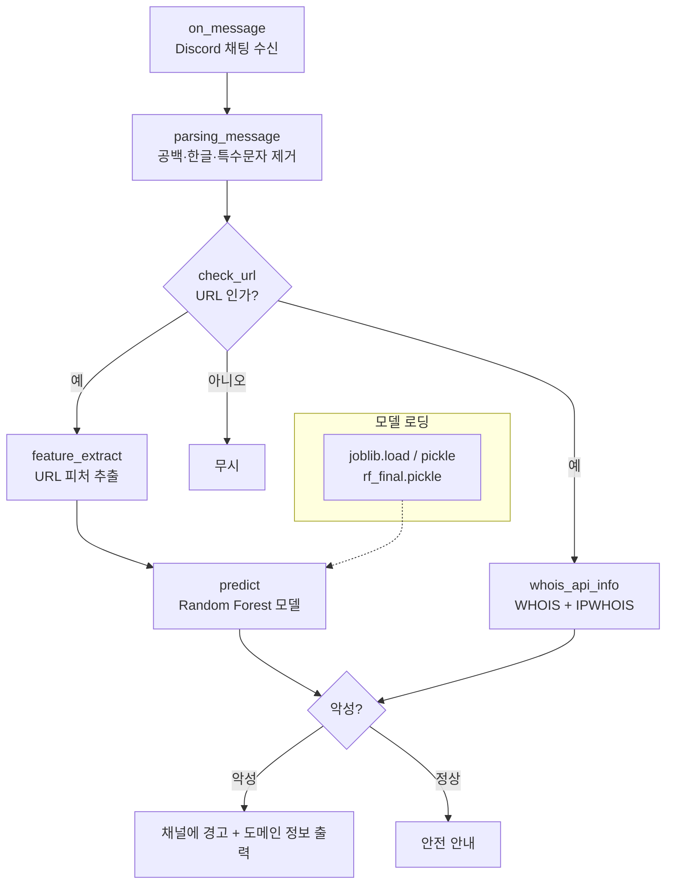

# 시스템 아키텍처 (System Architecture)

> 본 문서는 `Tonkatsu_bot.py`(432줄)의 실제 구현을 근거로 작성되었다.

## 개요

`discord.py` 기반 이벤트 봇이다. 채팅 메시지를 수신하면 → 난독화 해제 → URL 판별 →
피처 추출 → ML 예측 → WHOIS 조회 → 경고 출력의 파이프라인을 거친다. 모델은 `joblib`으로
로드되는 Random Forest(`rf_final.pickle`)이며, Heroku worker dyno로 상시 구동된다.

## 처리 파이프라인

| 단계 | 함수 | 역할 |
|---|---|---|
| 1. 수신 | `on_message` | 채널 메시지 이벤트. 봇 자신의 메시지는 무시 |
| 2. 난독화 해제 | `parsing_message` | 빈칸+특수문자, 특수문자+빈칸, 한글 등 삽입 패턴 제거 후 후보 토큰 추출 |
| 3. URL 판별 | `check_url` | 파싱된 문자열이 실제 URL인지 검사 |
| 4. 피처 추출 | `feature_extract`, `fd_length` | URL을 피처 벡터로 변환 (길이/카운트/IP/엔트로피 등) |
| 5. 예측 | `predict` | Random Forest로 악성 여부 분류 |
| 6. 도메인 정보 | `whois_api_info` | `whois` + `IPWhois`로 도메인/IP 등록 정보 조회 |
| 7. 응답 | `on_message` 내 출력 | 경고 메시지 + 도메인 정보를 채널에 전송 |

## Discord 이벤트 / 인텐트

- `discord.Intents.default()` + `message_content = True` (메시지 본문 접근 필수)
- `on_ready` — 봇 기동 시 사용자명 출력
- `on_message` — 핵심 탐지 로직 진입점
- 실행: `client.run(TOKEN)` — `TOKEN`은 환경변수(`os.environ.get('TOKEN')`)에서 로드

## 모델 로딩

- 모델 파일 `rf_final.pickle`을 원격(GitHub raw)에서 받아 `joblib.load(BytesIO(...))`로 메모리에 로드
- 로컬 경로 로딩(`joblib.load(model_path + 'rf_final.pickle')`)도 주석으로 대비되어 있음
- 학습 자산(노트북/데이터셋/모델)은 `모델 학습/`에 포함 → [모델 & 피처](../02-model/MODEL_AND_FEATURES.md)

> ⚠️ 원격 모델 fetch에 사용된 자격증명이 소스에 하드코딩되어 있다. **즉시 폐기 + 환경변수 전환** 필요.
> [시작 가이드 > 보안 주의](../03-guides/GETTING_STARTED.md#보안-주의) 참고.

## 배포 (Heroku)

- `Procfile`: `worker: python Tonkatsu_bot.py` — 웹 dyno가 아닌 **worker dyno**로 상시 구동
- `runtime.txt`: `python-3.11.6`
- `requirements.txt`: 의존성 고정

## 설계 특성

- **이중 검증**: ML 예측 + 도메인 정보로 단일 모델 오탐을 보완
- **난독화 대응**: 우회 삽입(공백/특수문자/한글)을 정규식으로 정규화 후 분석
- **원격 모델 로딩**: 봇 코드와 모델 아티팩트를 분리(별도 저장소에서 모델 fetch)

## 관련 문서

- [모델 & 피처](../02-model/MODEL_AND_FEATURES.md)
- [시작 가이드](../03-guides/GETTING_STARTED.md)
